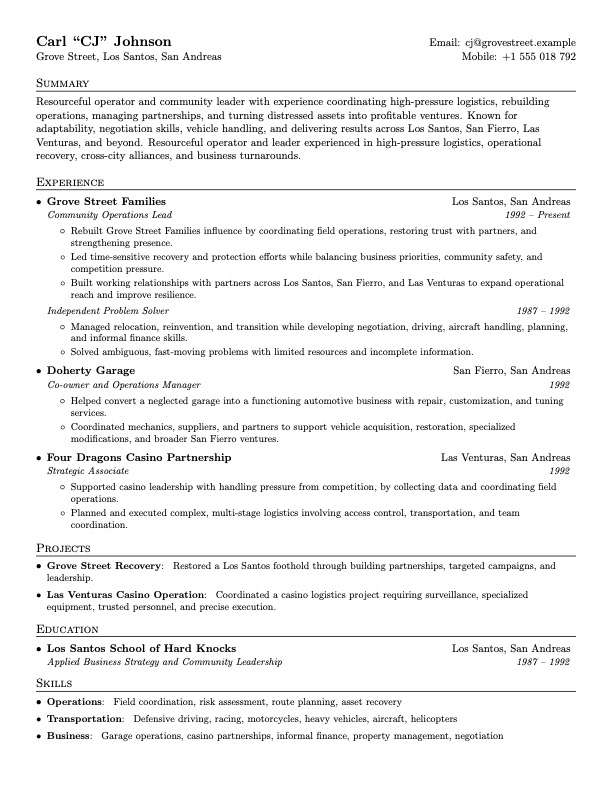

# Resume Manager

A helper tool for maintaining reusable LaTeX resume variants and creating
job-specific tailored resumes. The LaTeX template is based on Sourabh Bajaj's
[resume template](https://github.com/sb2nov/resume). Here is a sample resume
ChatGPT and I wrote together for Carl Johnson from GTA San Andreas:



### Motivation

Updating your resume based on the target job posting is an important step in
applying for jobs. However, manually copying, modifying, and renaming resume
files is both time consuming and repetitive, especially when different resume
variants are used as the basis for creating tailored versions. I built this
repository to simplify this process. I also updated the original template to
reduce the number of commands, and make their purpose easier to understand.

## Getting Started

Resume Manager is a single Makefile with a number of targets that help with
copying, renaming, and building PDF resumes from the LaTeX template. The `.tex`
files are divided into two categories: `variants` and `tailored`, where
`variants` are generic resumes for specific roles, such as `cpp_developer` or
`backend_engineer`, and `tailored` resumes are derived from variants for
specific job postings.

Keep in mind that there is no automatic content generation. Resume Manager is
only handling operations on files that otherwise have to be done manually.

### Quick Start

Using this tool requires `make`, `latexmk`, and a LaTeX distribution such as
TeX Live or MacTeX. Once the prerequisites are installed, you can clone the
repository:

```sh
git clone https://github.com/seinmon/resume-manager.git
cd resume-manager
```

Modify `variants/base.tex`, and optionally set the `FULLNAME` variable.

```sh
make
make new-variant VARIANT=ios FROM=base
make new TAILORED=apple-ios VARIANT=ios
make TAILORED=apple-ios
make export TAILORED=apple-ios
```

Omit the `.tex` extension from command variables. For example,
`make VARIANT=cpp` builds `variants/cpp.tex`.

### Repository Layout

```text
Makefile    Commands for creating, building, previewing, and cleaning resumes.
variants/   Reusable role-focused resumes.
tailored/   Job-specific resumes. Created by `make new`.
build/      Generated PDFs. Created by `make`.
out/        Exported tailored PDFs. Created by `make export`.
```

### Makefile Guide

Tailored resume filenames are based on `TAILORED`. For example:

```sh
make new TAILORED=apple-ios VARIANT=ios
```

creates `tailored/apple-ios.tex`, and:

```sh
make export TAILORED=apple-ios
```

copies the generated PDF to `out/apple-ios.pdf`.

Set the `FULLNAME` variable in the Makefile to prefix the tailored resume
filename with your name.

```makefile
FULLNAME ?= jane_doe
```

With that prefix configured:

```sh
make new TAILORED=apple-ios VARIANT=ios
make export TAILORED=apple-ios
```

uses `tailored/jane_doe_apple-ios.tex` and exports
`out/jane_doe_apple-ios.pdf`.

You can also pass `FULLNAME` per command instead of editing the Makefile:

```sh
make new TAILORED=apple-ios VARIANT=ios FULLNAME=jane_doe
make export TAILORED=apple-ios FULLNAME=jane_doe
```

Keep in mind that `FULLNAME` only prefixes the tailored resumes, and can only
contain letters, numbers, underscores, and hyphens.

Build the default resume variant:

```sh
make
```

This builds `variants/base.tex` into `build/base.pdf`.

Build a different resume variant:

```sh
make VARIANT=cpp
```

Create a new reusable resume variant from an existing variant:

```sh
make new-variant VARIANT=ios FROM=base
```

Create a tailored resume from a reusable variant:

```sh
make new TAILORED=company-name VARIANT=ios
```

Build a tailored resume:

```sh
make TAILORED=company-name
```

Build and export a tailored resume PDF:

```sh
make export TAILORED=company-name
```

List available variants and tailored resumes:

```sh
make list
```

Continuously rebuild the selected resume for preview:

```sh
make preview
make preview VARIANT=cpp
make preview TAILORED=company-name
```

Remove auxiliary build files and the generated PDF for the selected resume:

```sh
make clean
```

Remove `build` and `out` directories:

```sh
make cleanall
```

See the help message for available targets:

```sh
make help
```

## License

Licensed under MIT.
